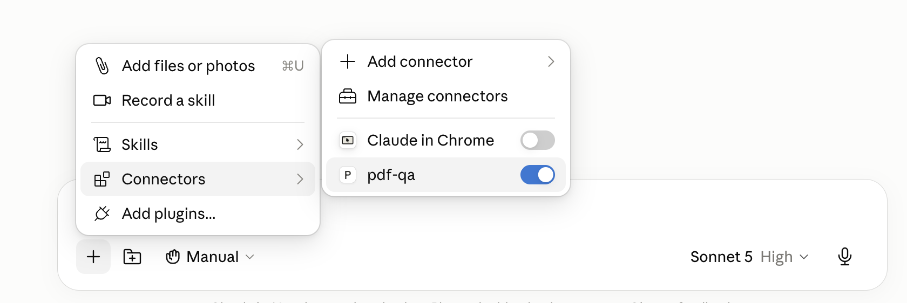
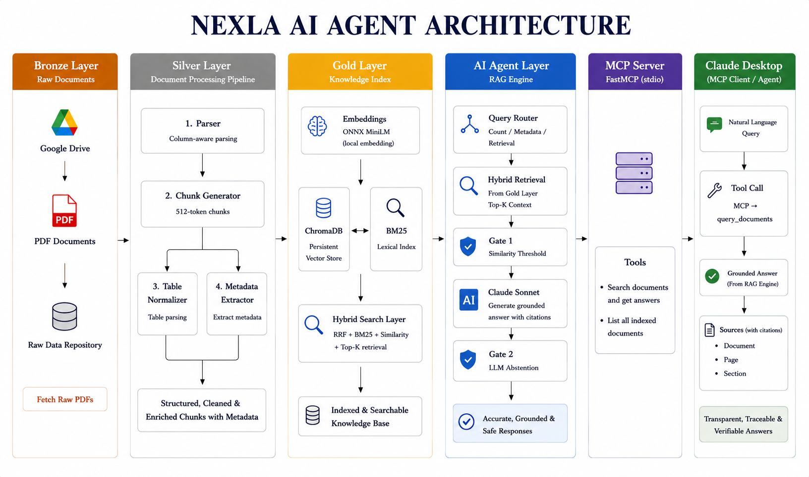
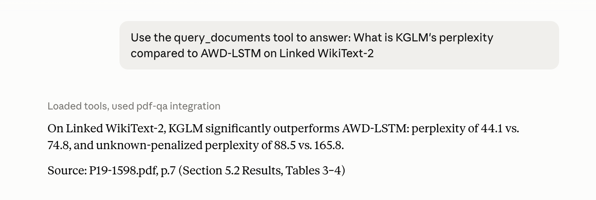
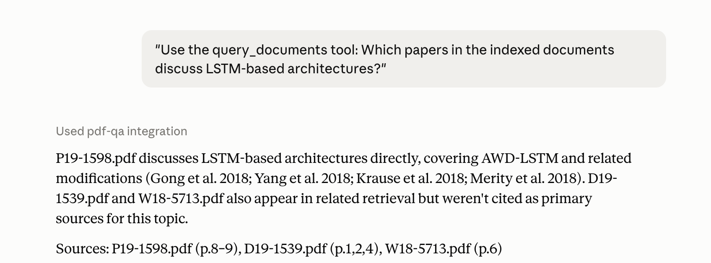
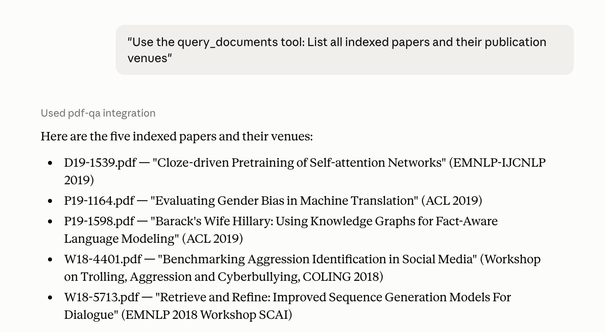

# 🤖 Nexla AI Agent
## 📄 PDF Q&A : MCP Server for Research Papers

An MCP server that answers natural language questions over academic PDFs with **grounded answers, exact source attribution, and explicit uncertainty handling**.

---

## ⚡ Quick Start

```bash
git clone https://github.com/Yeshwanth-git-tech/Nexla-AI-Agent.git
cd Nexla-AI-Agent
pip install -r requirements.txt

cp .env.example .env          # add your ANTHROPIC_API_KEY
rm -rf data/vectorstore       # clean start
python ingest.py --clear      # rebuild index (vision caches are committed, so no API cost)

python evaluate.py            # optional: run the gold question suite
python server.py              # start the MCP server
```

**Connect to Claude Desktop:** add this to `~/Library/Application Support/Claude/claude_desktop_config.json`:

```json
{
  "mcpServers": {
    "pdf-qa": {
      "command": "/absolute/path/to/python",
      "args": ["/absolute/path/to/server.py"]
    }
  }
}
```

Restart Claude Desktop. The tools show up in the connectors menu.



---

## 🏗️ Architecture



**Ingestion pipeline** (runs at startup, cached after the first pass):

- **Parser** : column aware PDF extraction, handles two column academic layouts
- **Chunker** : ~512 token chunks, each tagged with `{doc, page, section}`
- **Table Normalizer** : Claude vision on rendered table pages, results cached to disk
- **Metadata Extractor** : Claude vision on page 1 for title, authors, venue, counts
- **Index** : persistent ChromaDB (dense vectors) plus BM25 (lexical)

**Query engine** (per question):

- **Route** : count questions go to regex, metadata questions go to dedicated chunks, everything else goes to retrieval
- **Hybrid search** : RRF fusion of dense and lexical rankings, with guaranteed top 4 slots from each
- **Gate 1** : if the best similarity is below 0.35, return "unrelated to these documents" without making an API call
- **Generate** : Claude Sonnet answers from the top 8 chunks
- **Gate 2** : if the model says the answer isn't there, return "not found" plus the closest section

**Result:** 28 of 31 correct (93%) on the gold set.

---

## 📋 Project Structure

```
Nexla-AI-Agent/
├── parser.py               # column aware PDF extraction
├── chunker.py              # recursive chunking with page and section metadata
├── table_normalizer.py     # Claude vision on table pages (cached)
├── metadata_extractor.py   # Claude vision on page 1 (cached)
├── store.py                # persistent Chroma + BM25 + RRF fusion
├── ingest.py               # pipeline: parse, chunk, normalize, index
├── rag.py                  # routing, two gates, answer generation
├── evaluate.py             # 4 metric evaluation harness
├── server.py               # MCP server (FastMCP, stdio)
├── architecture.png        # architecture diagram
├── EXAMPLES.md             # text log of example Q&A interactions
├── eval_results.txt        # full evaluation output (28/31, 93%)
├── requirements.txt
├── .env.example
├── .gitignore
├── results/                # screenshots of live Claude Desktop interactions
└── data/
    ├── pdfs/               # the 5 source papers
    ├── gold/               # gold Q&A set (evaluation only, JSONL)
    ├── index/              # vision caches (committed, so first ingest is free)
    └── vectorstore/        # persistent Chroma (auto generated)
    
```

---

## 🛠️ MCP Tools

### `query_documents(question: str) -> str`

Answers a natural language question using the indexed PDFs.

**Input:** `question`, a natural language string.

**Output:** a JSON string.

```json
{
  "answer": "On Linked WikiText-2, KGLM achieves a perplexity of 44.1 vs. 74.8 for AWD-LSTM.",
  "answerable": true,
  "sources": [
    {"doc_name": "P19-1598.pdf", "page": 7, "section": "5.2 Results"}
  ]
}
```

When the question can't be answered from the documents, `answerable` is `false`, `sources` is empty, and `answer` explains why. Either the question is unrelated to the corpus, or it's related but the answer isn't stated anywhere in the text.

**Example queries:**

- "What is KGLM's perplexity compared to AWD-LSTM on Linked WikiText-2?"
- "Which papers discuss LSTM based architectures?"
- "How many times does the paper mention WikiText-2?"

### `list_documents() -> str`

Lists the indexed documents. Takes no arguments.

**Output:** a JSON string.

```json
[
  {"doc_name": "P19-1598.pdf", "pages": 10, "chunks": 34}
]
```

Useful for an agent that wants to orient itself before asking content questions.

---

## 🔧 How It Works

### Ingestion

1. **Parse** : pdfplumber pulls text with column awareness. It splits each page at the midline for two column layouts, then reads left side first.
2. **Chunk** : recursive splitting into ~512 token chunks that never cross a page boundary, each carrying `{doc, page, section}`.
3. **Normalize tables** : every page holding a table is rendered to PNG and sent to Claude, which rewrites it as explicit cell level statements. Results are cached by content hash.
4. **Extract metadata** : page 1 is rendered to PNG for title, authors, and venue. Page, word, and reference counts are computed directly from the text. One metadata chunk per document.
5. **Index** : chunks go into ChromaDB with ONNX MiniLM embeddings, plus an in memory BM25 index.

### Query

1. **Route** : the question is sorted into one of three buckets, count, metadata, or general.
2. **Count questions** : answered by regex over the full parsed text. Retrieval can't count occurrences across a whole document.
3. **Metadata questions** : queried against metadata chunks only, skipping the similarity gate, since author and venue phrasing embeds poorly against body text.
4. **General questions** : hybrid search. Dense and BM25 rankings are fused with RRF, and the top 4 from each ranker are guaranteed a slot.
5. **Gate 1** : if the best similarity sits below 0.35, the question is treated as unrelated and no API call is made.
6. **Generate** : Claude Sonnet answers from the top 8 chunks and returns source attribution.
7. **Gate 2** : if the model reports the answer isn't in the excerpts, the system returns "not found" and points at the closest section instead of guessing.

---

## ⚖️ Trade-offs

Every choice below cost something. Here's what, and why it was worth it.

**Local ONNX MiniLM embeddings instead of a hosted embedding model.**
MiniLM is a weaker retriever than `text-embedding-3-small` or `bge-small`, and some of the 67% hit rate traces back to that. In exchange, ingestion needs no second API key, adds about 90 MB instead of a multi gigabyte torch install, and runs fully offline. The BM25 half of the hybrid covers much of the gap on exact term queries, which is most of what academic Q&A asks for. Swapping the embedder is a one line change if accuracy starts mattering more than portability.

**Claude vision for tables instead of a text based table parser.**
This costs roughly three API calls per PDF on the first ingest and adds a caching layer to maintain. Still the right call. Text extraction of borderless academic tables quietly produces wrong numbers, and a wrong number delivered confidently is worse than no answer at all. Caching means the cost is paid once.

**Persistent ChromaDB instead of rebuilding the index on every run.**
Persistence means stale state is possible. If the PDFs change, the store has to be rebuilt explicitly with `--clear`. The alternative was re-embedding on every server start, which made Claude Desktop slow to launch and burned vision API calls over and over. `--clear` is the documented escape hatch.

**Two gates instead of always answering.**
The gates add a similarity check and, in ambiguous cases, an extra model round trip. They also refuse the occasional question the system could have handled, and Q21 and Q30 in the eval are exactly that. For a document grounded tool this is the right direction to fail in. A refusal can be fixed by rephrasing. A confident fabrication can't be fixed at all.

**Text only retrieval, no figure understanding.**
One evaluation question asks about layers drawn in a figure and simply can't be answered. Extending the vision approach to figures at query time is the obvious next step, but it would mean rendering images on every query rather than once at ingest, and the table work delivered more accuracy per hour spent inside the time budget.

---

## 💬 Example Interactions

**Example 1 : table question with source attribution**

> *"What is KGLM's perplexity compared to AWD-LSTM on Linked WikiText-2?"*



**Example 2 : cross document question**

> *"Which papers discuss LSTM based architectures?"*



**Example 3 : metadata across all documents**

> *"List all papers and their publication venues"*



Text versions of these interactions are in `EXAMPLES.md`.

---

## 📊 Evaluation Results

**Indexed documents** (5 ACL and arXiv papers):

- D19-1539.pdf : Cloze-driven Pretraining (EMNLP 2019)
- P19-1164.pdf : Gender Bias in Machine Translation (ACL 2019)
- P19-1598.pdf : Knowledge Graphs for Language Modeling (ACL 2019)
- W18-4401.pdf : Aggression Identification in Social Media (COLING 2018)
- W18-5713.pdf : Retrieve and Refine for Dialogue (EMNLP 2018)

**Metrics** (gold set, 31 questions, full output in `eval_results.txt`):

| Metric | Score | What it measures |
|--------|-------|------------------|
| Retrieval hit-rate@8 | 67% | gold evidence page appears in the top 8 retrieved |
| Numeric exact-match | 65% | every number in the gold answer appears in the prediction |
| Token F1 | 31% | word overlap with the gold answer |
| **LLM-judge correctness** | **90%** | factual correctness, judged strictly |

**Total: 28 of 31 correct, or 93% of answerable questions.**

### Reading these numbers honestly

The four metrics disagree with each other, and the disagreement is the useful part.

**Token F1 at 31% understates things badly.** The gold answers are terse, things like "Shorter." or "28", while the system returns a full sentence carrying the supporting evidence. Word overlap punishes that even when the answer is exactly right. It stays in the suite because it catches drift the judge might wave through, not because 31% means the system is wrong two thirds of the time.

**Numeric exact-match at 65% is the metric with real signal in it.** Several misses are genuine. Some gold answers expect an approximate count computed differently than the system computes it, since word counts and reference counts vary by extraction method. In one case the system reports a related figure from the correct table rather than the exact cell asked for. This is the number to watch when improving the system.

**Hit-rate@8 at 67% covers only 3 questions.** The rest of the gold set has no page level evidence field, so this number is directionally useful but not statistically meaningful.

**LLM-judge at 90% is the headline** because it measures the thing that matters, which is whether the answer is factually right. It's deliberately strict. Abstentions on answerable questions score zero instead of being credited as appropriate caution. An earlier, gentler version of the judge scored a perfect 1.00, which was flattering and useless.

**The judge has a ceiling too.** Q11 asks which language shows the greatest gender bias in Figure 2. The gold answer is Hebrew. The system answered French, reasoning from a table rather than the figure, and argued it well enough that the judge scored it correct. Numeric exact-match caught it at 0.00. That split is the whole reason for keeping four metrics instead of trusting one.

### The three failures, and why they stand

**Q20** asks what the combination layers in Figure 2 are for. Text only retrieval can't see figures, so this one is out of reach without vision at query time.

**Q30** asks for the first sentence on page 5. That's a positional lookup, not a semantic one, and semantic retrieval isn't built for it.

**Q21** asks whether all authors share an affiliation, and it fails for a more interesting reason. The gold question spells it "affilation", so the metadata router's keyword trigger never fires and the question falls through to general retrieval, where it hits the similarity gate and gets refused. A brittle trigger, and a fair thing for the eval to surface.

None of the three is a retrieval or generation bug. Two are scope limits and one is a routing weakness worth fixing.

---

## 🤖 Vibe Coding : How AI Was Used

**Tools.** Claude in a chat driven loop as a pair programmer for writing and debugging code, plus Claude Code for iterating on modules. A second AI model drafted the architecture diagram. Test first throughout, meaning each module was validated end to end on real output before the next one got built.

**What worked.** Handing Claude one narrow, well specified module at a time and running it immediately. Something like "write a column aware parser that returns page dicts with section headings" produces good code. Pasting real debug logs back for diagnosis worked far better than describing symptoms in prose, and that's how the RRF ranking problem surfaced, where a rank 1 BM25 hit was getting squeezed out of the fused top 8.

**What didn't.** Asking for large multi file changes in one shot. Trusting any output that hadn't been executed yet. Every significant bug in this project came from generated code that looked correct and wasn't.

### Where I overrode the AI

**ChromaDB over FAISS.** Chroma stores metadata natively alongside the vectors, so `{doc, page, section}` needs no parallel bookkeeping, and source attribution is a hard requirement here. I also rejected the initial in memory design and made persistence non negotiable. The vector store is a deliverable, not an implementation detail. We moved to `PersistentClient` with a `--clear` rebuild flag.

**Metadata as first class retrieval content.** Author and venue questions kept failing because that phrasing embeds poorly against body text. The retriever would return paper content and never touch the title block. The instinct was to patch the prompt. Instead I had metadata extracted once per document with vision on page 1, combined with counts computed directly from the text, and indexed as its own searchable chunk. That single change flipped a whole category of failing gold questions to correct, and it only works because Chroma keeps metadata next to vectors, which is also why Chroma won over FAISS.

**Hybrid dense and BM25 retrieval.** Academic Q&A leans on exact terms like "KGLM", "perplexity", and "WikiText-2" that pure embeddings miss. When plain RRF still dropped a rank 1 lexical hit, I added guaranteed slots for the top results from each ranker.

**pdfplumber over the first suggestion.** The initial draft reached for PyMuPDF on speed grounds, but these are two column ACL papers, and naive extraction interleaves the columns and destroys reading order, which corrupts every chunk downstream. pdfplumber exposes per character coordinates, so I could split each page at the midline and read the left column before the right. Unstructured was on the table too and I ruled it out for dependency conflicts and far more machinery than five PDFs warrant. The one thing pdfplumber does badly is borderless academic tables, and that weakness is exactly what pushed table handling over to Claude vision on rendered page images.

**Claude vision for table normalization.** I caught the system confidently reporting 0% where the paper said 6%, on a question the overlap metric had scored 0.80. Root cause was text extraction of borderless tables losing column alignment. Switching to vision on rendered page images was the single biggest accuracy jump in the project.

**Test first on a single PDF.** I insisted on proving parser, chunker, store, and RAG against a gold question harness on one paper before scaling to five or building the MCP layer.

**A stricter LLM judge.** The generated judge scored refusals as correct and produced a perfect 1.00. I rejected it and made abstentions on answerable questions fail automatically. The score dropped to 0.90, which is a number that actually means something.

### How AI fits into the workflow

It compresses the distance between an idea and a running prototype, and that's most of the value. What it doesn't do is decide. The choices that shaped this system, persistence, metadata indexing, hybrid retrieval, vision for tables, a judge that can fail, all came from evaluating real output against real requirements. The generator is fast and confidently wrong at unpredictable moments, so the verification loop isn't overhead. It's the part that makes the speed usable.

---

## 🔧 Tech Stack

- **PDF parsing:** pdfplumber
- **Embeddings:** all-MiniLM-L6-v2 (ONNX, local, ~90 MB)
- **Vector store:** ChromaDB (persistent, metadata rich)
- **Lexical search:** BM25 (rank_bm25)
- **LLM:** Claude Sonnet (vision and text)
- **MCP:** FastMCP (stdio transport)
- **Language:** Python 3.12+


**Cost:** the vision caches are committed, so ingestion costs nothing on a fresh clone. Regenerating them from scratch runs about $0.20. Each question costs roughly $0.02, since answering sends eight retrieved chunks to Claude Sonnet.


---

## 🚀 Future Improvements

- **Figure understanding** : extend the vision approach to charts at query time, which would clear the one known figure failure
- **Stronger embeddings** : `text-embedding-3-small` or `bge-small-en-v1.5` to lift the retrieval hit rate
- **Fuzzy metadata routing** : the Q21 failure came from a keyword trigger missing a misspelling, so the router should match on intent rather than exact terms
- **RAGAS metrics** : context precision and answer faithfulness alongside the current suite
- **Streaming responses** through the MCP tool for long syntheses
- **Scaling to more documents**

The core design holds up. Hybrid retrieval, grounded generation, and gates that prefer refusing over guessing.